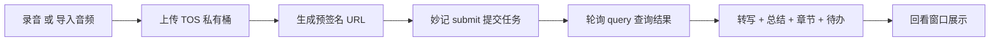

# 会议纪要 · 火山引擎接入与使用指南

本文档面向**首次使用本工具的人**，手把手教你在火山引擎开通所需能力、配置好凭证，并使用录音 / 导入音频 → 自动转写 → 会议总结 → 回看的完整流程。按本文从上到下操作即可复现，无需额外背景知识。

> 适用对象：需要"会议录音自动出文字纪要和总结"的用户。
> 本工具在 macOS 上运行，转写与总结依赖火山引擎（豆包）云服务。

---

## 1. 能力概述

本工具做两件事：

1. **采集音频**：实时录制（麦克风 + 系统声音）或导入已有音频文件（mp3 / m4a / wav 等）。
2. **云端处理**：把音频上传到你自己的对象存储（TOS），生成一个有时效的下载链接交给"豆包语音妙记"，妙记完成**转写（带说话人、时间戳）+ 全文总结 + 章节 + 待办事项**，结果回落到本工具的回看窗口。

### 1.1 数据流



### 1.2 两套独立凭证（重要）

很多人会在这里搞混。本工具需要**两套完全不同**的火山凭证：

| 用途 | 凭证 | 从哪来 |
| --- | --- | --- |
| 转写 + 总结（妙记） | **App ID + Access Token** | 火山「语音技术 / 豆包语音」控制台的应用 |
| 存音频（对象存储 TOS） | **Access Key ID + Secret Access Key** | 火山「访问控制 IAM」的子账号密钥 |

### 1.3 一个硬性依赖

**要拿到转写和总结，就必须配置 TOS。** 因为妙记只接受"公网可访问的音频 URL"，而这个 URL 由 TOS 生成。没有 TOS，本工具只能得到一段本地录音，没有文字和总结。

---

## 2. 前置条件

- 一个已完成**实名认证**的火山引擎账号：<https://www.volcengine.com>
- 一台 macOS 电脑，已安装本工具。

---

## 3. 开通「语音妙记」（转写 + 总结）

1. 登录火山引擎控制台，进入**语音技术 / 豆包语音**产品页（搜索"语音技术"或"豆包语音"）。
2. **创建应用**，在接入能力中勾选并开通**「语音妙记大模型」**服务。
3. 开通后进入**应用 / 服务详情页**，在「服务接口认证信息」中复制两项：
   - **App ID**
   - **Access Token**
4. 记下这两个值，稍后填进本工具设置里。

> 说明（无需手工操作，仅帮助理解）：本工具内部固定使用资源标识 `volc.lark.minutes`，调用时把 App ID 放入请求头 `X-Api-App-Key`、Access Token 放入 `X-Api-Access-Key`。你只要在设置里填对 App ID 和 Access Token 即可。
>
> 参考：豆包语音-妙记 API 接入文档 <https://www.volcengine.com/docs/6561/1798094>

---

## 4. 配置对象存储 TOS（存音频）

分四步：建桶 → 建子账号 → 配最小权限策略 → 拿 AK/SK。

### 4.1 建桶（用主账号）

1. 进入**对象存储 TOS** 控制台，**创建存储桶（Bucket）**。
2. 桶名示例：`boring-notch-meetings`（可自定义，记住它）。
3. 地域：选择离你近的区域，示例用**华东2（上海）**。
4. 读写权限：**保持私有**（不要开公共读）。本工具通过"预签名 URL"让妙记临时下载，无需公开桶。

### 4.2 Region ID 与 Endpoint 对照（关键，别踩坑）

本工具设置里的"Region"要填**火山的 Region ID**（英文代号），不是中文名。常见对照：

| 中文地域 | Region ID（填这个） | S3 外网 Endpoint（工具自动拼接） |
| --- | --- | --- |
| 华北2（北京） | `cn-beijing` | tos-s3-cn-beijing.volces.com |
| 华东2（上海） | `cn-shanghai` | tos-s3-cn-shanghai.volces.com |
| 华南1（广州） | `cn-guangzhou` | tos-s3-cn-guangzhou.volces.com |
| 中国香港 | `cn-hongkong` | tos-s3-cn-hongkong.volces.com |
| 亚太东南（柔佛） | `ap-southeast-1` | tos-s3-ap-southeast-1.volces.com |

> **常见错误**：把"华东2"误填成 `cn-east-2`。火山**没有** `cn-east-2` 这个 Region，正确的是 `cn-shanghai`。填错会导致上传时报 TLS 连接失败。
>
> 若不确定桶在哪个区，可在 TOS 控制台桶列表 → 点开桶 → 概览页底部查看"访问域名"。
>
> 参考：地域和访问域名 <https://www.volcengine.com/docs/6349/107356>

### 4.3 创建子账号（IAM 用户）

不要用主账号密钥。进入**访问控制（IAM）**：

1. **用户 → 创建用户**，勾选**编程访问**（生成 API 访问密钥）。
2. 记下用户名，稍后给它授权。

### 4.4 配置最小权限策略

**权限策略 → 新建自定义策略**，粘贴以下 JSON（把桶名换成你自己的）：

```json
{
  "Statement": [
    {
      "Effect": "Allow",
      "Action": [
        "tos:PutObject",
        "tos:GetObject",
        "tos:DeleteObject"
      ],
      "Resource": [
        "trn:tos:::boring-notch-meetings/*"
      ]
    },
    {
      "Effect": "Allow",
      "Action": [
        "tos:HeadBucket",
        "tos:GetBucketLocation"
      ],
      "Resource": [
        "trn:tos:::boring-notch-meetings"
      ]
    }
  ]
}
```

- `PutObject`：上传录音。
- `GetObject`：**不能省**。妙记要通过预签名 URL 下载音频，回看窗口也要读音频；缺了它妙记会报下载失败、回看无法播放。
- `DeleteObject`：本工具删除会议时会同步删掉 TOS 上的文件。
- 第二段（HeadBucket/GetBucketLocation）用于探测桶，属可选增强。

创建后把该策略**附加给刚建的子账号**。

> Action / Resource 的确切名称以控制台策略编辑器提示为准（TOS 的 action 前缀是 `tos:`，资源 TRN 形如 `trn:tos:::桶名/对象前缀`）。个别名称若报错按提示补全。
>
> 参考：创建用户并授权 <https://www.volcengine.com/docs/6257/1356587>

### 4.5 创建 Access Key（AK/SK）

给该子账号**创建 Access Key**，得到：

- **Access Key ID**（形如 `AKLT...`）
- **Secret Access Key**

> Secret Access Key 只在创建时显示一次，务必立即保存。

---

## 5. 在应用中填写凭证

打开工具，进入**设置**（菜单栏图标 → 设置…，或主窗口的设置入口）。

### 5.1 「凭证」页

| 分区 | 字段 | 填写内容 |
| --- | --- | --- |
| 豆包妙记（会后总结） | App ID | 第 3 步的 App ID |
| 豆包妙记（会后总结） | Access Token | 第 3 步的 Access Token |
| 火山 TOS 云存储 | Access Key ID | 第 4.5 步的 AK |
| 火山 TOS 云存储 | Secret Access Key | 第 4.5 步的 SK |
| 火山 TOS 云存储 | Bucket | 你的桶名（示例 `boring-notch-meetings`） |
| 火山 TOS 云存储 | Region | 你的 Region ID（示例 `cn-shanghai`） |

### 5.2 「通用」页

- **识别语言**：中文 / English。
- **音频来源**：麦克风 + 系统音频 / 仅麦克风 / 仅系统音频。
- **会议结束后自动生成总结**：开启后，录音/导入结束会自动走妙记（需已填妙记 + TOS）。
- **本地保存路径**：留空用默认（`~/Documents/BoringNotch/Meetings`）。

---

## 6. 使用说明

### 6.1 录音

1. 主窗口点**录音按钮**（或菜单栏「开始录制」）。
2. **首次会请求「屏幕录制」权限**（采集系统声音需要）与「麦克风」权限，按提示在系统设置里授权后重开应用。
3. 录制中可看到**滚动声波**和计时。
4. 点停止后，工具自动：把录音转成 m4a → 上传 TOS → 交妙记 → 出转写和总结 → 存入历史。整个后处理在后台进行，完成后有系统通知。

> 录音以 16kHz 单声道保存，麦克风若为 48kHz 会自动重采样，保证时长与音质正确。

### 6.2 导入已有音频测试

不想现场录，也可直接跑已有文件：

1. 主窗口点**「导入音频文件测试」**。
2. 选择本地 mp3 / m4a / wav 文件。
3. 工具按与录音相同的链路处理（上传 → 妙记 → 总结）。

### 6.3 回看窗口

在左侧**历史会议**列表点任意一条打开回看窗口：

- **播放器**：播放录音，可拖动进度条。
- **转录**页：歌词式逐句显示，随播放高亮并自动滚动；点某一句可**跳转到该时刻**；不同说话人有不同颜色标签。
- **总结**页：全文总结、章节概要（含时间点）、待办事项（含负责人）、问答摘要。
- **导出**：右上角可导出为**纯文本**或 **SRT 字幕**。
- **重命名**：点标题旁铅笔图标。

### 6.4 历史管理

- 右键历史条目可**查看回看**或**删除**。
- 删除会同步删除 TOS 上的音频 / 转写 / 总结文件（需 DeleteObject 权限）。

---

## 7. 常见问题排查

| 现象 | 原因 | 解决 |
| --- | --- | --- |
| 上传报 `A TLS error caused the secure connection to fail.` | Region / Endpoint 写错（如把华东2 填成 `cn-east-2`），域名不存在 | 改成真实 Region ID（华东2 = `cn-shanghai`），见 4.2 |
| 妙记报 `4020: http error` | 妙记下载预签名 URL 失败（签名不对或没有读权限） | 确认子账号有 `GetObject`，桶名 / Region 与实际一致 |
| 上传 / 下载报 `403` | 子账号权限不足或资源范围不含该桶 | 检查策略里的 Action 和 `Resource` 桶名，见 4.4 |
| 只有本地录音、没有文字和总结 | 未配置 TOS，或未开启"自动生成总结" | 补齐 TOS 凭证并开启自动总结 |
| 录音时长明显偏长 / 声音变慢 | 麦克风采样率未重采样（旧版本问题） | 本工具已内部重采样到 16kHz，升级到当前版本即可 |
| 回看无法播放云端音频 | 缺 `GetObject`，或预签名 URL 过期 | 补权限；重新打开回看会重新生成链接 |

---

## 8. 安全建议

- **用最小权限子账号**，只授予对这一个桶的读 / 写 / 删；不要在工具里填主账号密钥。
- **桶保持私有 + 预签名 URL**，不要开公共读。
- **定期轮换 / 及时禁用** 泄露风险的 AK/SK。
- **配置生命周期规则**（可选）：给桶设"N 天后自动删除"，避免录音长期堆积产生存储费——本地和妙记侧另有留存。
- 注意：AK/SK、妙记 Token 以明文保存在应用本地偏好设置中，仅本机可读；这也是更应使用受限子账号的原因。

---

## 附录：涉及的火山产品与文档

- 语音技术 / 豆包语音（妙记）：<https://www.volcengine.com/docs/6561/1798094>
- 对象存储 TOS 地域与访问域名：<https://www.volcengine.com/docs/6349/107356>
- 访问控制 IAM 创建用户并授权：<https://www.volcengine.com/docs/6257/1356587>
